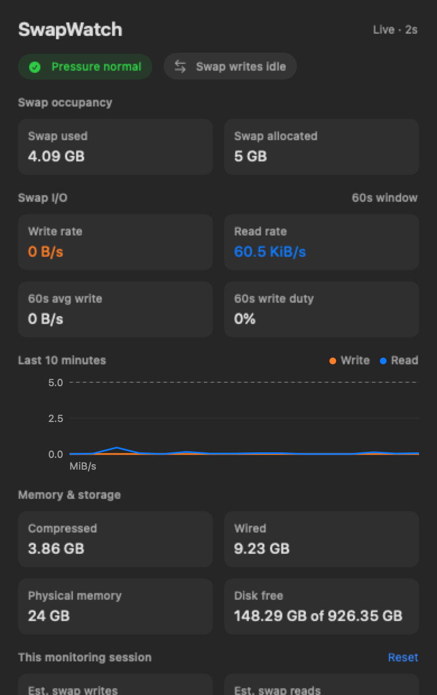

# SwapWatch


**Is swap usage burning out your SSD?**

SwapWatch is a focused macOS menu-bar app that shows memory pressure, swap usage, and estimated swap-write activity. When the OS runs out of memory it starts using your SSD. The SSD is slower than RAM and can only support a finite number of reads and writes 



*The actual dashboard with live readings from a Mac. Hover over metrics for explanations.*

## Why use it?

Mac SSDs are soldered to the board and difficult to replace. Use this tool while using things like LM Studio to keep an eye on memory pressure and swap writes.

I use it while running models locally in LM Studio so my laptop enjoys a long life.

### Did you write it? 

I did not. Codex researched APIs to get swap information and wrote the tool for me. I've never written a line of Swift in my life. This whole thing is vibe coded.

### Contributions

Contributions welcome! Open issues and pull requests 🚀

## Get SwapWatch

Requires **macOS 13 or newer** and Xcode to build. There isn't a downloadable release yet; build the app locally:

```sh
git clone git@github.com:danieljurek/swap-watch.git
cd swap-watch
bash scripts/build-app.sh
open dist/SwapWatch.app
```

If Xcode requests onboarding, open Xcode and complete its license and component installation first.

SwapWatch appears in your menu bar, not the Dock. Click it to open the dashboard, adjust warning thresholds, or quit. To start it automatically, add the built app in **System Settings → General → Login Items**.

## Warnings

SwapWatch warns when it sees sustained write above a threshold. The default value is very low because I want to know when regular use of my laptop while running LLMs increases strain on my memory and SSD. 

## Development

```sh
swift test
dist/SwapWatch.app/Contents/MacOS/SwapWatch --diagnose
```

The build uses the Swift toolchain selected by `xcode-select` (or an explicit `DEVELOPER_DIR`), generates the app icon from `swap-watch.png`, and applies a local ad-hoc signature. It is not a notarized distribution build. Generated build files are excluded from Git.

See [verification notes](docs/verification.md) for testing and runtime checks.
